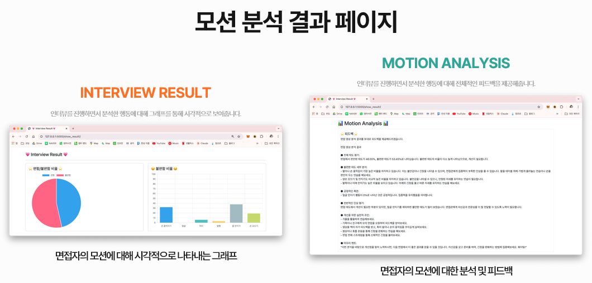

# 👋 안녕하세요, 백엔드 개발자 홍혜창입니다

### 💡 적극적이고 열정적인 개발자

---

## 🚀 About Me

> **작동 원리를 이해하고, 프로젝트에 적용하는 개발자**

-  **학습 방식**: "왜 이렇게 작동하는가?"를 중심으로 깊이 있게 학습합니다
-  **강점**: 배운 내용을 실전 프로젝트에 즉시 적용하는 활용 능력
  - GPT API 수업 수강 → AI 면접 서비스 개발
  - Spring Boot 학습 → 게시판 프로젝트 + AWS 배포
-  **약점 극복 중**: 익숙한 기술에 머무르지 않고 새로운 기술 도전 중
  - 현재: Spring Boot, Docker, CI/CD 등 다양한 기술 스택 확장 중

---

## 🎓 Education & Achievements

| 항목 | 내용 |
|------|------|
| **졸업 예정** | 2026년 2월 |
| **학점** | 4.4 / 4.5 |
| **자격증** | 정보처리기사 |
| **수상** | ACK 2024 한국정보처리학회 학부생논문경진대회 동상 |

---

## 🤝 Volunteer Experience

### 초등학생 코딩 교육 봉사 (2024.01 ~ 2024.02)

- 📅 **기간**: 5일, 총 30시간
- 💻 **내용**: HTML/JavaScript 기반 틀린그림찾기 게임 제작 교육
- 🎯 **목표**: 코딩의 즐거움을 전달하고, 논리적 사고력 향상 도모

**[📂 프로젝트 보러가기](https://github.com/Honghyechang/Coding-Education-Volunteer)** | **[🎬 시연 영상](https://youtu.be/HKWUzKDn9Eo)** | **[🌐 Live Demo](https://honghyechang.github.io/Coding-Education-Volunteer/)**

---

## 💼 Main Projects

### 1️⃣ Spring Boot Portfolio

  

**Spring Boot 학습 + 게시판 프로젝트 + AWS 배포 자동화**

- 🗓️ **기간**: 2024.06 ~ 2024.12
- 👤 **구성**: 개인 프로젝트
- 🛠️ **기술 스택**  
  
  
  
  
  
  

**✨ 핵심 특징**
- ✅ Spring Boot 학습 및 프로젝트 진행
- ✅ Docker 컨테이너화 및 AWS Elastic Beanstalk 배포
- ✅ GitHub Actions를 활용한 CI/CD 파이프라인 구축
- ✅ JPA/Hibernate를 활용한 데이터베이스 설계

**[📖 상세보기](https://github.com/Honghyechang/Spring-Boot-Portfolio)** | **[🎬 애플리케이션 시연](https://youtu.be/9Fm3FfhFaMQ)** | **[🚀 CI/CD 시연](https://youtu.be/TQRcmNF6O1g)**

---

### 2️⃣ Store Shield

  

**AI 기반 스마트 무인점포 통합관리 시스템** 

- 🗓️ **기간**: 2025.01 ~ 2025.08 (7개월)
- 👥 **구성**: 5인 팀 프로젝트
- 🏆 **수상**: Qualcomm University Platform Symposium 2025 선정
- 🛠️ **기술 스택**  
  
  
  
  
  
  

**✨ 핵심 특징**
- 🤖 **YOLO-NAS 기반 객체 탐지**: 실시간 고객 행동 분석 및 이상행동 감지
- 📱 **실시간 기록 시스템**: Socket.IO를 활용한 점주 앱 실시간 기록
- 🎯 **온디바이스 AI**: 엣지 디바이스에서 AI 모델 실행으로 응답속도 향상
- 📊 **통합 관리 대시보드**: 재고 관리, 매출 분석, CCTV 모니터링 통합

**[📖 상세보기](https://github.com/Honghyechang/Store-Shield)** | **[🎬 시연 영상](https://youtu.be/4Jdi7Hx5ZVs)**

---

### 3️⃣ AI Interview Coach

  

**언어적·비언어적 요소를 분석하는 AI 면접 코칭 시스템** 

- 🗓️ **기간**: 2024.06 ~ 2024.12 (6개월)
- 👥 **구성**: 팀 프로젝트
- 🏆 **수상**: ACK 2024 한국정보처리학회 학부생논문경진대회 **동상**
- 📄 **논문**: 학회지 게재
- 🛠️ **기술 스택**  
  
  
  
  
  

**✨ 핵심 특징**
- 🗣️ **언어 분석**: Google STT + GPT-3.5 기반 답변 내용 평가
- 👁️ **비언어 분석**: MediaPipe 기반 시선 추적 및 자세 분석
- 🤖 **자체 AI 모델**: SVM 기반 행동 분류 모델 개발
- 📊 **실시간 피드백**: 면접 종료 후 종합 리포트 제공

**[📖 상세보기](https://github.com/AI-Interview-Coach)** | **[📄 논문 보기](https://github.com/AI-Interview-Coach/.github/blob/main/profile/docs/papers/%EB%85%BC%EB%AC%B8_%ED%95%99%EA%B5%90%EB%AA%85%EC%A0%9C%EA%B1%B0.pdf)** | **[📊 발표자료](https://github.com/AI-Interview-Coach/.github/blob/main/profile/docs/papers/%EB%B0%9C%ED%91%9C%EC%9E%90%EB%A3%8C_%ED%95%99%EA%B5%90%EB%AA%85%EC%A0%9C%EA%B1%B0.pdf)**

---

## 🛠️ Tech Stack

### 💪 자신 있는 기술

| 기술 | 사용 프로젝트 |
|------|---------------|
| **Java** | [Spring Boot Portfolio](https://github.com/Honghyechang/Spring-Boot-Portfolio), [Store Shield](https://github.com/Honghyechang/Store-Shield) |
| **Spring Boot** | [Spring Boot Portfolio](https://github.com/Honghyechang/Spring-Boot-Portfolio) |
| **Flutter** | [Gourmet](https://github.com/Honghyechang/Gourmet) |
| **MySQL** | [Spring Boot Portfolio](https://github.com/Honghyechang/Spring-Boot-Portfolio), [Store Shield](https://github.com/Honghyechang/Store-Shield) |

---

### 🌱 경험해본 기술

| 기술 | 사용 프로젝트 |
|------|---------------|
| **Flask** | [AI Interview Coach](https://github.com/AI-Interview-Coach), [Store Shield](https://github.com/Honghyechang/Store-Shield) |
| **React** | [ReLife](https://github.com/Honghyechang/ReLife) |
| **Firebase** | [Gourmet](https://github.com/Honghyechang/Gourmet) (Firestore, Authentication, Storage) |
| **Swift** | [N-Taxi](https://github.com/Honghyechang/NTAXI_IOS) |
| **Android (Java)** | [Store Shield CCTV](https://github.com/Honghyechang/Store-Shield) |
| **Docker** | [Spring Boot Portfolio](https://github.com/Honghyechang/Spring-Boot-Portfolio) |
| **AWS** | [Spring Boot Portfolio](https://github.com/Honghyechang/Spring-Boot-Portfolio) (Elastic Beanstalk) |
| **CI/CD** | [Spring Boot Portfolio](https://github.com/Honghyechang/Spring-Boot-Portfolio) (GitHub Actions) |
| **HTML/CSS/JS** | [Coding Education Volunteer](https://github.com/Honghyechang/Coding-Education-Volunteer) |

---

## 📚 Additional Projects

### ReLife (리마스터)
**음성 명령 기반 장애인 통합 복지 플랫폼**

- 🗓️ 2024.09 ~ 2024.12 (4개월)
- 👥 4인 팀 프로젝트
- 🛠️ React, Web Speech API, FullCalendar, Google Maps API

**[📖 상세보기](https://github.com/Honghyechang/ReLife)** | **[🎬 시연 영상](https://youtu.be/rhYzZlGEvUg)**

---

### Gourmet (구르맛)
**대학생 맞춤 위치 기반 맛집 추천 플랫폼**

- 🗓️ 2024.09 ~ 2024.12 (15주)
- 👥 4인 팀 프로젝트
- 🛠️ Flutter, Firebase (Authentication, Firestore, Storage)

**[📖 상세보기](https://github.com/Honghyechang/Gourmet)** | **[🎬 시연 영상](https://www.youtube.com/watch?v=uawsgHIxjP8)**

---

### N-Taxi
**iOS 기반 대학생 전용 택시 합승 플랫폼**

- 🗓️ 2024.04 ~ 2024.06 (3개월)
- 👤 개인 프로젝트
- 🛠️ Swift, CoreLocation, MapKit, Core Data

**[📖 상세보기](https://github.com/Honghyechang/NTAXI_IOS)**

---

## 📖 Interview Preparation

### 💻 코딩테스트 대비
**Java 기반 알고리즘 문제 풀이**

- 📚 프로그래머스 플랫폼 활용
- 🎯 자료구조, 알고리즘 개념 정리 및 구현

**[📂 레포지토리 보러가기](https://github.com/Honghyechang/Preparing-for-coding-tests)**

---

### 📝 CS 면접 대비
**컴퓨터 과학 핵심 개념 정리**

- 🖥️ 운영체제, 네트워크, 데이터베이스
- 💡 실전 면접 질문 및 답변 준비

**[📂 레포지토리 보러가기](https://github.com/Honghyechang/cs-interview-prep)**

---

## 📫 Contact

### 함께 성장하고 싶은 백엔드 개발자, 홍혜창입니다

**질문 한느 것을 부끄러워하지 않고, 계속해서 앞으로 나아가는 개발자가 되겠습니다** 

