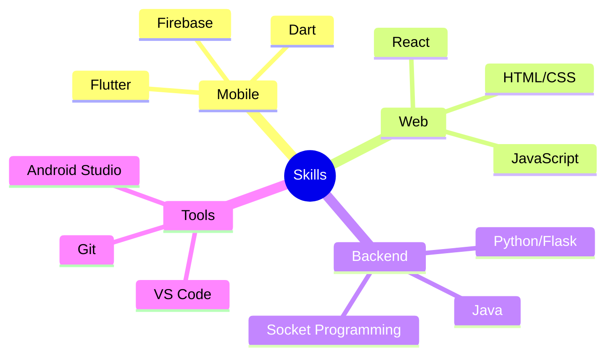

# 👋 Hello, I'm Hyechang Hong

  

## 🚀 About Me
> *"사용자 경험을 혁신하는 크로스 플랫폼 개발자"*

한성대학교 모바일소프트웨어트랙 4학년 재학 중인 개발자입니다. 
모바일 앱과 웹 개발을 넘나들며 다양한 플랫폼에서 사용자 경험을 혁신하는 것을 목표로 합니다.

### 🎓 Academic Excellence
- 한성대학교 모바일소프트웨어트랙 (평점: 4.45/4.5)
- 산학공동연구회 동상 수상

## 💻 Tech Stack

**Frontend & Mobile**  

**Mobile Development**  

**Backend & Database**  

## 🌟 Featured Projects

### 1. [AI 면접 준비 서비스](https://github.com/Honghyechang/ai-interview-service)

- `Python` `Flask` `AI` `영상처리`
- 취준생을 위한 AI 기반 모의 면접 플랫폼
- 언어/비언어적 요소 통합 분석 및 피드백 제공
- 🏆 산학공동연구회 동상 수상

### 2. [구르맛 - 대학생 맛집 SNS](https://github.com/Honghyechang/gourmet-sns)

- `Flutter` `Firebase` 
- 스레드 형식의 맛집 리뷰 플랫폼
- SNS 스타일의 직관적인 UX/UI 구현

### 3. [장애인 복지 통합 서비스](https://github.com/Honghyechang/welfare-platform)

- `React` `음성인식` `웹접근성`
- 음성 명령을 통한 웹 페이지 네비게이션
- 장애인 웹 접근성 향상 프로젝트

### 4. [몸으로 말해요 - 화상 채팅 게임](https://github.com/Honghyechang/video-chat-game)

- `Java` `Socket Programming`
- 실시간 화상 채팅 및 게임 기능 구현
- 멀티플레이어 게임 시스템 개발

## 📊 GitHub Stats

  

  

## 🔍 Skills Breakdown

## 📫 Contact Me

  

  

---

  
### 👀 Profile Views
  

<!--
이메일과 포트폴리오 주소를 실제 주소로 교체해주세요.
각 프로젝트의 레포지토리 링크도 실제 주소로 교체해주세요.
-->
